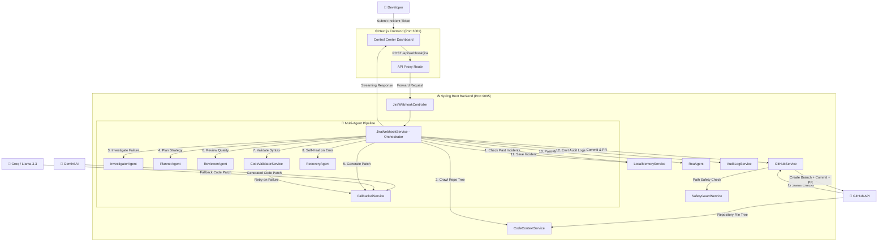

# 🤖 AUTOMATA — Autonomous Incident-to-PR Control Center

> **"From ticket to pull request — fully autonomous."**

Automata is a production-grade **Autonomous Engineering Agent System** that takes a software incident ticket from a web UI, coordinates a team of specialized AI agents, generates a validated code fix, and opens a **draft pull request** on GitHub — all without human intervention.

It dramatically reduces **Mean Time To Resolution (MTTR)** for software bugs and feature requests by combining multi-agent reasoning, self-healing validation loops, persistent incident memory, and real GitHub integration.

---

## 📋 Table of Contents

1. [Key Features](#-key-features)
2. [System Architecture](#-system-architecture)
3. [Data Flow Diagram (DFD)](#-data-flow-diagram-dfd)
4. [Agent Descriptions](#-agent-descriptions)
5. [Technology Stack](#️-technology-stack)
6. [Project Structure](#-project-structure)
7. [Setup & Installation](#-setup--installation)
8. [Environment Variables](#-environment-variables)
9. [API Reference](#-api-reference)
10. [Demo Scenarios](#-demo-scenarios)
11. [How It Works — Step by Step](#-how-it-works--step-by-step)
12. [Self-Healing Loop](#-self-healing-loop)
13. [Local Memory System](#-local-memory-system)
14. [Contributing](#-contributing)

---

## 🌟 Key Features

| Feature | Description |
|---|---|
| 🧠 **Multi-Agent Orchestration** | 5 specialized AI agents work in a coordinated pipeline (Planner → Investigator → AI Patch → Reviewer → Recovery) |
| 🔁 **Self-Healing Validation** | Syntax and brace-balance failures trigger automatic retry loops with error feedback (up to 3 iterations) |
| 🧬 **Persistent Incident Memory** | `memory.json` stores resolved incidents and uses keyword similarity to find patterns in past fixes |
| 🐙 **Real GitHub Integration** | Creates branches, commits files, and opens draft PRs via the GitHub REST API |
| 🌐 **Multi-Language Support** | Handles `.java`, `.py`, `.go`, `.ts`, `.js`, `.properties`, `.xml`, `.yml`, `.yaml` source files |
| 🛡️ **Safety Guard** | Validates all AI-generated file paths before commit to prevent dangerous writes |
| 📊 **Live Dashboard** | Next.js frontend with real-time agent execution timeline, patch diffing, PR tracking, and logs |
| 🤖 **AI Fallback Chain** | Routes through Gemini → Groq (Llama-3.3) with graceful fallback if one provider is unavailable |

---

## 🏗️ System Architecture

Automata follows a **clean layered architecture** with a clear separation between the UI, API gateway, orchestration layer, agent layer, and external integrations.

```
┌─────────────────────────────────────────────────────────────┐
│                   AUTOMATA SYSTEM                           │
│                                                             │
│  ┌──────────────────────────────────────────────────────┐   │
│  │            Next.js Frontend (Port 3001)              │   │
│  │  ┌─────────────┐  ┌──────────────┐  ┌────────────┐  │   │
│  │  │Submit Ticket│  │ Live Timeline│  │  Patch Diff│  │   │
│  │  └──────┬──────┘  └──────────────┘  └────────────┘  │   │
│  └─────────┼────────────────────────────────────────────┘   │
│            │ POST /api/webhook/jira                         │
│  ┌─────────▼────────────────────────────────────────────┐   │
│  │         Spring Boot Backend (Port 9095)              │   │
│  │                                                      │   │
│  │  JiraWebhookController ──► JiraWebhookService        │   │
│  │                                    │                 │   │
│  │              ┌─────────────────────┤                 │   │
│  │              ▼                     ▼                 │   │
│  │  LocalMemoryService       CodeContextService         │   │
│  │   (memory.json)          (GitHub Tree Crawler)       │   │
│  │                                    │                 │   │
│  │         ┌──────────────────────────┘                 │   │
│  │         ▼                                            │   │
│  │   ┌─────────────────────────────────────────────┐   │   │
│  │   │           Multi-Agent Pipeline              │   │   │
│  │   │  InvestigatorAgent → PlannerAgent →         │   │   │
│  │   │  FallbackAiService → ReviewerAgent →        │   │   │
│  │   │  CodeValidatorService → RecoveryAgent       │   │   │
│  │   └────────────────────┬────────────────────────┘   │   │
│  │                        ▼                            │   │
│  │       GitHubService ──► SafetyGuardService          │   │
│  │              │                                      │   │
│  │              ▼                                      │   │
│  │   AuditLogService  RcaAgent  ErrorExtractor         │   │
│  └──────────────┬───────────────────────────────────────┘   │
│                 │                                           │
│  ┌──────────────▼──────────────────────────────────────┐   │
│  │              External Systems                        │   │
│  │  ┌──────────────────┐   ┌──────────────────────┐   │   │
│  │  │   GitHub API      │   │   AI Providers        │   │   │
│  │  │  Branch / Commit  │   │  Gemini + Groq/Llama  │   │   │
│  │  │  PR Creation      │   │  (Fallback Chain)     │   │   │
│  │  └──────────────────┘   └──────────────────────┘   │   │
│  └──────────────────────────────────────────────────────┘   │
└─────────────────────────────────────────────────────────────┘
```

---

## 📊 Data Flow Diagram (DFD)

### Level 0 — Context Diagram

```
           ┌────────────────┐
           │   Developer /  │
           │   Engineer     │
           └───────┬────────┘
                   │ Submit Incident Ticket
                   ▼
         ┌─────────────────────┐
         │                     │
         │    AUTOMATA SYSTEM  │──────────► GitHub (Draft PR)
         │                     │
         └─────────────────────┘
                   │
                   ▼
         ┌─────────────────────┐
         │   AI Providers      │
         │  (Gemini / Groq)    │
         └─────────────────────┘
```

### Level 1 — Top-Level Data Flow



### Level 2 — GitHubService Detail

```
Input: filePath, fileContent, ticketKey, ticketSummary
          │
          ▼
┌────────────────────────────────────────────────────────┐
│                   GitHubService                        │
│                                                        │
│  1. SafetyGuardService.validate(filePath)              │
│          │ PASS                                        │
│          ▼                                             │
│  2. GET /repos/{owner}/{repo}/git/refs/heads/{base}    │
│     (Get SHA of base branch)                           │
│          │                                             │
│          ▼                                             │
│  3. POST /repos/.../git/refs                           │
│     (Create feature branch: fix/ticketKey-timestamp)   │
│          │                                             │
│          ▼                                             │
│  4. GET /repos/.../contents/{filePath}?ref={branch}    │
│     (Check if file already exists → get SHA if so)     │
│          │                                             │
│          ▼                                             │
│  5. PUT /repos/.../contents/{filePath}                 │
│     (Upsert file: Base64 encoded content)              │
│          │                                             │
│          ▼                                             │
│  6. POST /repos/.../pulls                              │
│     (Create Draft Pull Request)                        │
│          │                                             │
│          ▼                                             │
│  7. GET /repos/.../commits/{sha}/check-runs            │
│     (Wait for CI status checks to pass)                │
└────────────────────────────────────────────────────────┘
                    │
                    ▼
          Output: PR URL, PR Number
```

---

## 🧠 Agent Descriptions

Each agent is a focused, single-responsibility component that contributes to the incident resolution pipeline.

### 1. 🔍 InvestigatorAgent
**File:** [`InvestigatorAgent.java`](src/main/java/com/automata/service/agent/InvestigatorAgent.java)

Performs the initial diagnosis of an incident. It analyzes the ticket description, extracts error signatures (stack traces, exception types, method references), and cross-references against the fetched code context to pinpoint the likely fault location.

- **Input**: Ticket summary, description, code context snippets
- **Output**: Investigation report with fault hypothesis and affected files

### 2. 📋 PlannerAgent
**File:** [`PlannerAgent.java`](src/main/java/com/automata/service/agent/PlannerAgent.java)

Classifies the incident type (bug fix vs. feature request vs. refactor) and produces a structured repair strategy. Decides which files need to be created or modified.

- **Input**: Investigation report from InvestigatorAgent
- **Output**: Structured plan with file targets, fix approach, and acceptance criteria

### 3. 🤖 FallbackAiService
**File:** [`FallbackAiService.java`](src/main/java/com/automata/service/ai/FallbackAiService.java)

The code generation engine. Sends a structured prompt to Gemini AI first, and falls back to Groq (Llama-3.3-70B) if Gemini is unavailable or returns an error. Extracts multi-file code blocks from the AI response.

- **Input**: Planning context, code context, error details
- **Output**: Map of `{filePath → fileContent}` representing the proposed code patch

### 4. 🔎 ReviewerAgent
**File:** [`ReviewerAgent.java`](src/main/java/com/automata/service/agent/ReviewerAgent.java)

Reviews the generated patch for code quality, security footprint, and maintainability. Scores the patch and adds review annotations to the audit log.

- **Input**: Generated code patch
- **Output**: Review score, quality annotations

### 5. 🔧 RecoveryAgent
**File:** [`RecoveryAgent.java`](src/main/java/com/automata/service/agent/RecoveryAgent.java)

Triggered when `CodeValidatorService` detects a syntax error in the generated patch. Reformulates the AI prompt with the specific error message and requests a corrected code block. Allows up to **3 self-healing retry attempts**.

- **Input**: Original patch, validation error message
- **Output**: Corrected code patch (or escalation after max retries)

### 6. 📝 RcaAgent
**File:** [`RcaAgent.java`](src/main/java/com/automata/service/agent/RcaAgent.java)

Generates a post-mortem **Root Cause Analysis (RCA)** report after a successful fix. Documents the root cause, contributing factors, timeline, and preventive measures.

- **Input**: Full incident resolution context
- **Output**: Structured post-mortem engineering report

---

## 🛠️ Technology Stack

### Frontend
| Technology | Version | Purpose |
|---|---|---|
| Next.js | 14 | React framework, API routes, SSR |
| React | 18 | UI component library |
| TypeScript | 5 | Type-safe frontend code |
| Vanilla CSS | — | Custom Codeforces-styled dashboard |

### Backend
| Technology | Version | Purpose |
|---|---|---|
| Java | 21 | Core runtime language |
| Spring Boot | 3.3.0 | Web framework, DI, REST controller |
| Maven | 3.x | Build tool & dependency management |
| Lombok | — | Boilerplate reduction (getters, builders) |
| Jackson | 2.x | JSON serialization/deserialization |

### AI & Integrations
| Service | Purpose |
|---|---|
| Google Gemini API | Primary code generation model |
| Groq Cloud (Llama-3.3-70B) | Fallback code generation model |
| GitHub REST API v3 | Branch/commit/PR management |

---

## 📁 Project Structure

```
automata/
├── app/                          # Next.js App Router
│   ├── layout.tsx                # Root layout
│   └── page.tsx                  # Main dashboard page (redirects to /dashboard)
│
├── src/main/java/com/automata/   # Spring Boot Backend
│   ├── AutomataApplication.java  # Spring Boot entry point
│   ├── controller/
│   │   └── JiraWebhookController.java   # REST endpoint: POST /api/webhook/jira
│   ├── model/                    # Data transfer objects (DTOs)
│   └── service/
│       ├── JiraWebhookService.java      # 🎯 CORE: Orchestrates entire pipeline
│       ├── GitHubService.java           # GitHub API: branches, commits, PRs
│       ├── CodeContextService.java      # Fetches & scores relevant repo files
│       ├── CodeValidatorService.java    # Validates AI-generated code syntax
│       ├── SafetyGuardService.java      # Validates file paths before commit
│       ├── LocalMemoryService.java      # Persistent incident memory (memory.json)
│       ├── AuditLogService.java         # Structured event logging
│       ├── ErrorExtractor.java          # Extracts error signatures from tickets
│       ├── agent/
│       │   ├── InvestigatorAgent.java   # Diagnoses root cause
│       │   ├── PlannerAgent.java        # Plans fix strategy
│       │   ├── ReviewerAgent.java       # Reviews patch quality
│       │   ├── RecoveryAgent.java       # Self-healing retry loop
│       │   └── RcaAgent.java            # Generates post-mortem report
│       └── ai/
│           └── FallbackAiService.java   # Gemini → Groq fallback AI chain
│
├── src/main/resources/
│   └── application.properties    # Spring Boot config (reads .env vars)
│
├── memory.json                   # Persistent incident memory database
├── pom.xml                       # Maven project definition
├── package.json                  # Node.js project config
└── .env                          # Environment variables (DO NOT COMMIT)
```

---

## 🚀 Setup & Installation

### Prerequisites

Before you begin, ensure you have the following installed:

| Tool | Version | Download |
|---|---|---|
| Java JDK | 21+ | [adoptium.net](https://adoptium.net) |
| Maven | 3.8+ | [maven.apache.org](https://maven.apache.org) |
| Node.js | 18+ | [nodejs.org](https://nodejs.org) |
| Git | Any | [git-scm.com](https://git-scm.com) |

You also need accounts and API keys for:
- **Google AI Studio** — [aistudio.google.com](https://aistudio.google.com) (for Gemini API key)
- **Groq Cloud** — [console.groq.com](https://console.groq.com) (for Groq API key)
- **GitHub** — Personal Access Token with `repo` scope

---

### Step 1: Clone the Repository

```bash
git clone https://github.com/SatyaisCoding/automata.git
cd automata
```

---

### Step 2: Configure Environment Variables

Create a `.env` file in the project root:

```bash
cp .env.example .env   # if example exists, or create from scratch
```

Edit `.env` and fill in your credentials:

```env
# ─── AI Configuration ───────────────────────────────────────
# Set to false to use real AI models
USE_MOCK_AI=false

# Google Gemini API Key (primary model)
GEMINI_API_KEY=your_gemini_api_key_here

# Groq Cloud API Key (fallback model: Llama-3.3-70B)
GROQ_API_KEY=your_groq_api_key_here

# ─── GitHub Configuration ────────────────────────────────────
# Personal Access Token with 'repo' scope
GITHUB_TOKEN=ghp_your_personal_access_token

# Target repository owner (username or org name)
GITHUB_OWNER=your_github_username

# Target repository name (where PRs will be created)
GITHUB_REPO=your_target_repo_name

# Default base branch for PRs
GITHUB_DEFAULT_BRANCH=main
```

> ⚠️ **Never commit your `.env` file.** It is already in `.gitignore`.

---

### Step 3: Start the Backend (Spring Boot)

```bash
# Option A: Build and run (recommended first time)
mvn clean package -DskipTests
mvn spring-boot:run

# Option B: Run directly (if already built)
mvn spring-boot:run
```

The backend starts on **port 9095**. You should see:
```
Started AutomataApplication in X.XXX seconds
Tomcat started on port(s): 9095 (http)
```

---

### Step 4: Start the Frontend (Next.js)

Open a **new terminal window** in the same directory:

```bash
# Install Node.js dependencies
npm install

# Start development server
npm run dev
```

The frontend starts on **port 3001**. Open your browser:

```
http://localhost:3001
```

---

## 🔐 Environment Variables

| Variable | Required | Default | Description |
|---|---|---|---|
| `USE_MOCK_AI` | No | `false` | If `true`, uses a mock AI service instead of real APIs |
| `GEMINI_API_KEY` | Yes (if not mock) | — | Google Gemini API key for primary code generation |
| `GROQ_API_KEY` | Yes (if not mock) | — | Groq Cloud API key for fallback code generation |
| `GITHUB_TOKEN` | Yes | — | GitHub PAT with `repo` scope |
| `GITHUB_OWNER` | Yes | — | GitHub user/org that owns the target repository |
| `GITHUB_REPO` | Yes | — | Repository name where branches/PRs are created |
| `GITHUB_DEFAULT_BRANCH` | No | `main` | Base branch for new feature branches |
| `GITHUB_WEBHOOK_SECRET` | No | — | HMAC-SHA256 secret key to verify incoming GitHub webhook signatures |
| `JIRA_WEBHOOK_SECRET` | No | — | Shared secret token query parameter to verify incoming Jira webhook triggers |

---

## 📡 API Reference

### POST `/api/webhook/jira`

The primary endpoint that receives incident tickets and triggers the multi-agent pipeline. Can be protected using the `secret` query parameter.

**Port:** `9095`  
**Content-Type:** `application/json`  
**Query Param:** `secret` (optional, shared secret token)  

#### Request Body

```json
{
  "issue": {
    "key": "BUG-405",
    "fields": {
      "summary": "ArrayIndexOutOfBoundsException in UserMapper",
      "description": "Stack trace: ...\n\nThe mapCsvLine method does not validate array length before accessing index 3.",
      "issuetype": {
        "name": "Bug"
      }
    }
  }
}
```

### POST `/api/webhook/github`

Alternative endpoint that receives GitHub issue webhook events and maps them to the multi-agent pipeline. Verifies integrity using signature headers.

**Port:** `9095`  
**Content-Type:** `application/json`  
**Required Header:** `X-Hub-Signature-256` (HMAC-SHA256 signature when secret is configured)  

#### Request Body (GitHub Issues webhook event payload)

```json
{
  "action": "opened",
  "issue": {
    "id": 1234567,
    "number": 42,
    "title": "NullPointerException in PaymentService",
    "body": "Method dereferences user object without checking for null. Error logs: ..."
  }
}
```

#### Response Body (Unified Response for both Webhooks)

The response is a rich JSON object with the full execution telemetry:

```json
{
  "ticketKey": "GH-42",
  "summary": "NullPointerException in PaymentService",
  "status": "success",
  "investigationReport": "...",
  "planningStrategy": "...",
  "proposedFix": {
    "PaymentService.java": "public class PaymentService { ... }"
  },
  "validationResult": "PASSED",
  "reviewScore": 8.5,
  "prUrl": "https://github.com/owner/repo/pull/7",
  "rcaReport": "...",
  "memoryMatchFound": true,
  "auditLog": [...]
}
```

---

## 🧪 Demo Scenarios

The frontend provides preset scenarios to demonstrate the full end-to-end pipeline.

### 🔴 Scenario A: Bug Fix — NullPointerException (NPE)

1. Open the dashboard at `http://localhost:3001`
2. Toggle mode to **Live Mode**
3. Click the **Scenario A (NPE)** preset. Fields auto-fill:
   - **Ticket ID**: `PROD-1234`
   - **Summary**: `NullPointerException in Payment Service`
4. Click **Analyze Incident**
5. Watch the **Timeline** tab animate as agents execute:
   - 🔍 Investigator diagnoses the NPE location
   - 📋 Planner classifies as a null-check bug and targets the service file
   - 🤖 AI generates the null-safe code patch
   - 🔎 Reviewer scores the patch quality
   - 🔧 Validator confirms syntax is clean
   - 🐙 GitHub Service commits to a new branch and opens a draft PR
6. View the patch in **Proposed Fix** tab and the PR link in **Pull Requests** tab

---

### 🟡 Scenario B: Bug Fix — Array Bounds Exception

1. Toggle to **Live Mode**
2. Click the **Scenario B (Array Bounds)** preset:
   - **Ticket ID**: `BUG-405`
   - **Summary**: `ArrayIndexOutOfBoundsException in UserMapper`
   - **Description**: Includes the stack trace and the fix code hint
3. Click **Analyze Incident**
4. The system will create or modify `UserMapper.java` in the target repository
5. Verify the draft PR contains `UserMapper.java` with bounds validation added

---

### 🟢 Scenario C: Feature Request — Create a New Java File

1. Toggle to **Live Mode**
2. Enter a **custom ticket**:
   - **Summary**: `Create Calculator.java with add function`
   - **Description**: `We need a new Calculator class with a public static int add(int a, int b) method`
3. Click **Analyze Incident**
4. The system will create `Calculator.java` from scratch and open a PR

---

### 🔵 Scenario D: Feature Extension — Modify Existing File

1. After running Scenario C above, create a **follow-up ticket**:
   - **Summary**: `Add multiply and divide to Calculator.java`
   - **Description**: `Add multiply(int a, int b) and divide(double a, double b) methods to the existing Calculator class`
2. Click **Analyze Incident**
3. The system fetches the existing `Calculator.java` from GitHub, modifies it, and opens a new PR

---

## ⚙️ How It Works — Step by Step

Here is the complete execution flow when you submit an incident ticket:

```
Step 1: Ticket Received
  └─► JiraWebhookController receives POST /api/webhook/jira

Step 2: Memory Lookup
  └─► LocalMemoryService searches memory.json for similar past incidents
      (keyword/token similarity matching)

Step 3: Code Context Crawl
  └─► CodeContextService calls GitHub API to get the repository file tree
      Scores files by keyword relevance to the ticket description
      Fetches top-N relevant file contents for AI context

Step 4: Investigation
  └─► InvestigatorAgent analyzes ticket + code context
      Produces a fault hypothesis and affected file list

Step 5: Planning
  └─► PlannerAgent classifies issue type (bug/feature/refactor)
      Produces a structured repair strategy with target files

Step 6: Code Generation
  └─► FallbackAiService sends structured prompt to Gemini
      If Gemini fails → retries with Groq (Llama-3.3-70B)
      Parses multi-file code blocks from AI response

Step 7: Code Review
  └─► ReviewerAgent evaluates patch for quality and security
      Scores the patch and logs annotations

Step 8: Validation (with Self-Healing)
  └─► CodeValidatorService checks syntax (brace balance, null content)
      If validation fails → RecoveryAgent reformulates prompt with error
      Retries up to 3 times (self-healing loop)

Step 9: GitHub Operations
  └─► SafetyGuardService validates all file paths
  └─► GitHubService:
      a. Gets base branch SHA
      b. Creates new feature branch (fix/TICKET-KEY-timestamp)
      c. Checks if file exists (for upsert vs. create)
      d. Commits file with Base64-encoded content
      e. Opens Draft Pull Request
      f. Waits for CI status checks

Step 10: Post-Mortem
  └─► RcaAgent generates Root Cause Analysis report

Step 11: Memory Save
  └─► LocalMemoryService saves resolved incident to memory.json

Step 12: Response
  └─► Full telemetry JSON returned to frontend dashboard
```

---

## 🔁 Self-Healing Loop

One of Automata's most powerful features is its ability to automatically fix broken AI-generated code:

```
AI generates code patch
        │
        ▼
CodeValidatorService validates:
  - Are all braces/brackets balanced? {}[]()
  - Is file content non-empty?
  - Is the file path valid?
        │
   PASS │ FAIL
        │   │
        │   ▼
        │  RecoveryAgent reformulates prompt:
        │  "Previous attempt failed: {error}"
        │  "Please regenerate with this fix in mind"
        │         │
        │         ▼
        │   FallbackAiService (retry #1, #2, #3)
        │         │
        │    [Max 3 retries]
        │         │ PASS
        ▼         ▼
    Commit & Create PR
```

If all 3 retries fail, the incident is marked as `VALIDATION_FAILED` and logged to the audit trail without a PR being created.

---

## 🧬 Local Memory System

Automata maintains a persistent incident database at `memory.json`. This acts as a **semantic memory cache** that helps the system:

1. **Recognize similar past incidents** — If a NullPointerException was fixed before, the system provides that context to the AI for a faster, more accurate fix
2. **Track resolution patterns** — Which file types are commonly affected, which fix strategies work
3. **Build institutional knowledge** — Over time, the system becomes smarter about your specific codebase

```json
{
  "incidents": [
    {
      "ticketKey": "PROD-1234",
      "summary": "NullPointerException in Payment Service",
      "resolvedAt": "2024-01-15T10:30:00Z",
      "prUrl": "https://github.com/owner/repo/pull/5",
      "fixedFiles": ["PaymentService.java"],
      "keywords": ["null", "pointer", "payment", "service"]
    }
  ]
}
```

---

## 🌿 Branches

The project uses the following branches:

| Branch | Purpose |
|---|---|
| `main` | Stable, production-ready code |
| `automata-backend` | Java Spring Boot backend development |
| `automata-ui` | Next.js frontend development |
| `migrate-to-java` | Migration work from TypeScript API to Java |
| `fix/*` | Auto-generated branches for each incident PR (in target repo) |

---

## 🤝 Contributing

1. Fork the repository
2. Create a feature branch: `git checkout -b feature/my-new-feature`
3. Make your changes and add tests
4. Commit your changes: `git commit -m 'Add some feature'`
5. Push to the branch: `git push origin feature/my-new-feature`
6. Open a Pull Request

---

## 📄 License

This project was built for a hackathon demonstration. See [LICENSE](LICENSE) for details.

---

<p align="center">
  Built with ❤️ by the Automata team
</p>
